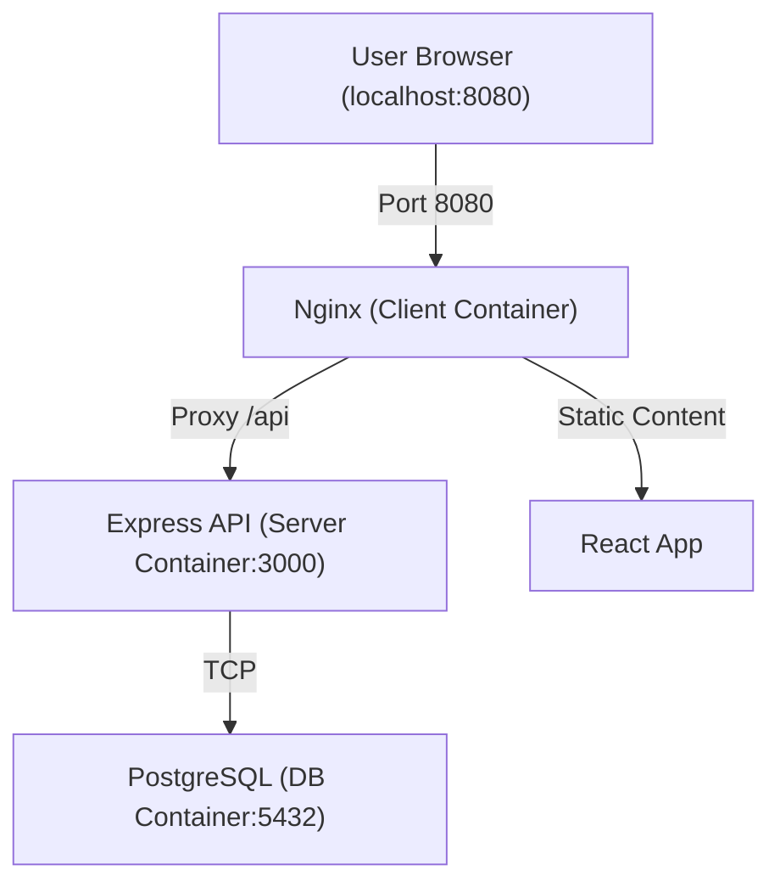

# The Meridian Grid

A centralized IoT dashboard designed to monitor, analyze, and control a fleet of physical and virtual machines.

## Project Overview

The Meridian Grid (TMG) acts as a bridge between the physical world of mechatronics and modern software architecture. It provides real-time visualization of sensor data and remote actuation capabilities, serving as a comprehensive learning platform for full-stack development, containerization, and industrial communication protocols.

## Architecture



## Getting Started

### Prerequisites
- Docker & Docker Compose

### Running the Application

1. **Clone the repository.**
2. **Create a `.env` file** in the `TheMeridianGrid/` directory (refer to `.env.example` if available).
3. **Start the stack:**
   ```bash
   docker-compose up --build
   ```
4. **Access the application:**
   - Frontend: [http://localhost:8080](http://localhost:8080)
   - API Status: [http://localhost:8080/api/hello](http://localhost:8080/api/hello)

## Tech Stack
- **Frontend:** React, TypeScript, Vite, Nginx
- **Backend:** Node.js, Express, TypeScript
- **Database:** PostgreSQL
- **Orchestration:** Docker Compose
