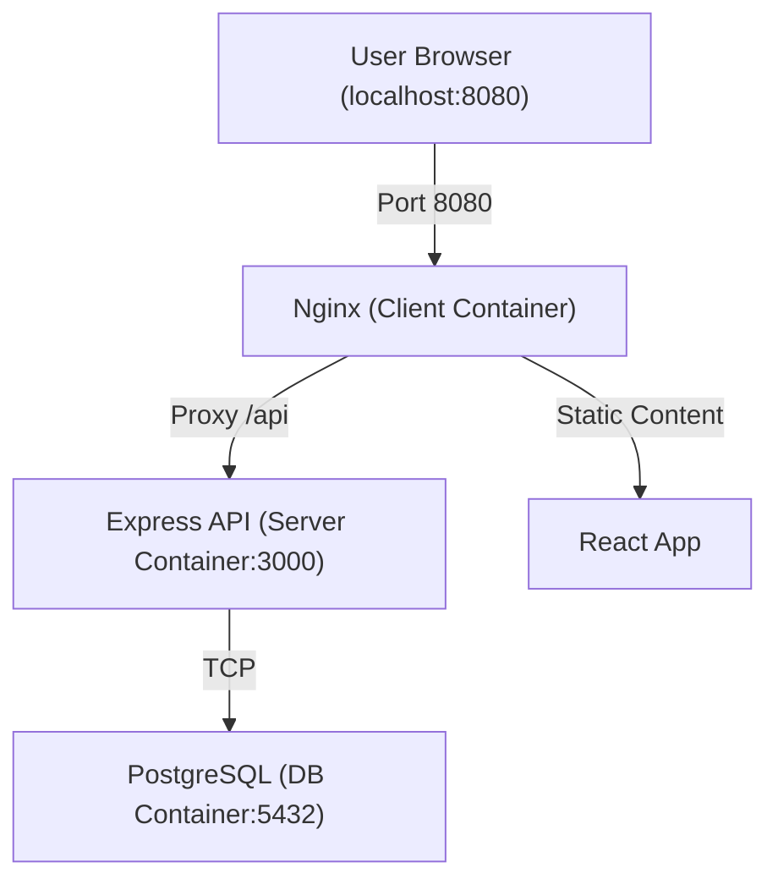

# The Meridian Grid

A centralized IoT dashboard designed to monitor, analyze, and control a fleet of physical and virtual machines.

## Project Overview

The Meridian Grid (TMG) acts as a bridge between the physical world of mechatronics and modern software architecture. It provides real-time visualization of sensor data and remote actuation capabilities, serving as a comprehensive learning platform for full-stack development, containerization, and industrial communication protocols.

## Architecture



## Getting Started

### Prerequisites
- Docker & Docker Compose

### Running the Application

1. **Clone the repository.**
2. **Create a `.env` file** in the `TheMeridianGrid/` directory (refer to `.env.example` if available).
3. **Start the stack:**
   ```bash
   docker-compose up --build
   ```
4. **Access the application:**
   - Frontend: [http://localhost:8080](http://localhost:8080)
   - API Status: [http://localhost:8080/api/hello](http://localhost:8080/api/hello)

## Weekly Progress

### Week 1: Scaffolding & Containerization
- [x] Initialized Vite/React frontend and Express/TypeScript backend.
- [x] Containerized both services using Docker.
- [x] Orchestrated the stack with Docker Compose and Nginx reverse proxy.
- [x] Established basic client-server communication.

### Week 2: Database & API Design
- [x] Conducted requirements gathering and BPA analysis.
- [x] Designed the ERD and semantic data model (AAS/DTDL inspired).
- [x] Implemented Prisma ORM with PostgreSQL.
- [x] Created a modular API architecture (Service-Controller-Router).
- [x] Implemented full CRUD for Asset Management with Zod validation.

### Week 3: Core Features (Telemetry & Rules)
- [x] Enabled TimescaleDB and created `telemetry` hypertable.
- [x] Implemented transactional Telemetry Ingestion Service.
- [x] Built Rules Engine with synchronous evaluation and alert deduplication.
- [x] Verified system with end-to-end Simulation Script.
- [x] Refined architecture with Global Error Handling and PlantUML documentation.

## Tech Stack
- **Frontend:** React, TypeScript, Vite, Nginx
- **Backend:** Node.js, Express, TypeScript
- **Database:** PostgreSQL
- **Orchestration:** Docker Compose
