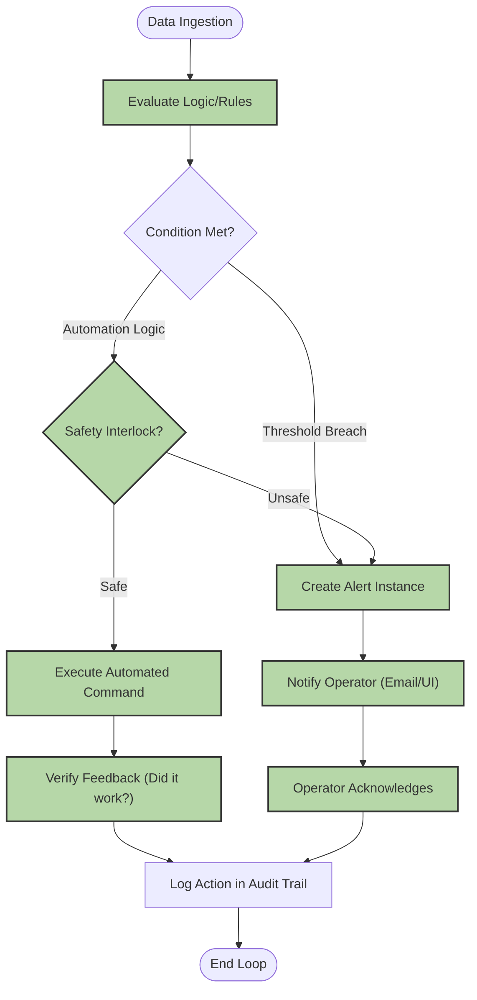

# Business Process Maps (BPMN)

This document visualizes the core business processes to ensure all steps are covered by User Stories.

## Process 1: Asset Onboarding & Configuration
**Actor:** Device Integrator

## Gap Analysis: Process 1 (Asset Onboarding)

| Process Step | User Story ID | Status |
| :--- | :--- | :--- |
| Define Semantic Model | CORE-01 | ✅ Covered |
| Configure MQTT Mapping | CORE-02 | ✅ Covered |
| Select Asset Template | CORE-06 | ✅ Covered |
| Define Relations | CORE-03 | ✅ Covered |
| Add Metadata | CORE-04 | ✅ Covered |
| Define Health Rules | CORE-05 | ✅ Covered |
| Test Connection/Simulate | CORE-10 | ✅ Covered |
| Activate (Draft -> Active) | CORE-09 | ✅ Covered |
| Data Retention/Governance | CORE-42 | ✅ Covered |

---

## Process 2: Identity, Access & Role Management
**Actor:** System Administrator

This process defines how users are onboarded and how security boundaries are enforced between "Integrators" (Builders) and "Operators" (Users).

## Gap Analysis: Process 2 (Identity & Access)

| Process Step | User Story ID | Status |
| :--- | :--- | :--- |
| Admin Log in | IAM-14 | ✅ Covered |
| Input User Details (Create) | IAM-11 | ✅ Covered |
| Assign Global Role | IAM-12 | ✅ Covered |
| Assign Scope (Site/Asset) | IAM-13 | ✅ Covered |
| Create Custom Role | IAM-16 | ✅ Covered |
| Verify MFA | IAM-15 | ✅ Covered |
| Check Permissions (Enforcement) | IAM-14 / IAM-16 | ✅ Covered |
| Audit Activity | IAM-18 | ✅ Covered |
| developer Shortcut | IAM-21 | ✅ Covered |
| Platform Health Monitoring | IAM-44 | ✅ Covered |

---

## Process 3: Dashboard Composition & Monitoring
**Actors:** [[Device Integrator]] (to build) and [[Operator]] (to use).

## Gap Analysis: Process 3 (Dashboard & Monitoring)

| Process Step | User Story ID | Status |
| :--- | :--- | :--- |
| Create & Save Dashboard | HMI-22 | ✅ Covered |
| Grid Layout Management | HMI-23 | ✅ Covered |
| Widget Library | HMI-24 | ✅ Covered |
| Data Binding | HMI-25 | ✅ Covered |
| Real-time Streaming (WS) | HMI-26 | ✅ Covered |
| Time-series Filtering | HMI-27 | ✅ Covered |
| Remote Control Interface | HMI-28 | ✅ Covered |
| Share/Publish | HMI-29 | ✅ Covered |
| Kiosk Mode | HMI-30 | ✅ Covered |
| Mobile Adaptive | HMI-31 | ✅ Covered |
| UI Theming (Dark/Light) | HMI-43 | ✅ Covered |

---

## Process 4: Intelligent Automation & Alert Response
**Actors:** [[Operator]] (Human), [[System Agent]] (Automated Logic)

## Gap Analysis: Process 4 (Automation)

| Process Step | User Story ID | Status |
| :--- | :--- | :--- |
| Evaluate Logic/Rules (Engine) | AUTO-32 | ✅ Covered |
| Create Alert Instance | AUTO-33 | ✅ Covered |
| Notify Operator | AUTO-34 | ✅ Covered |
| Operator Acknowledges | AUTO-35 | ✅ Covered |
| Safety Interlock Check | AUTO-37 | ✅ Covered |
| Execute Automated Command | AUTO-36 | ✅ Covered |
| Verify Feedback | AUTO-38 | ✅ Covered |
| Maintenance Suppression | AUTO-39 | ✅ Covered |
| Alert Correlation | AUTO-40 | ✅ Covered |
| Agent Registry | AUTO-41 | ✅ Covered |