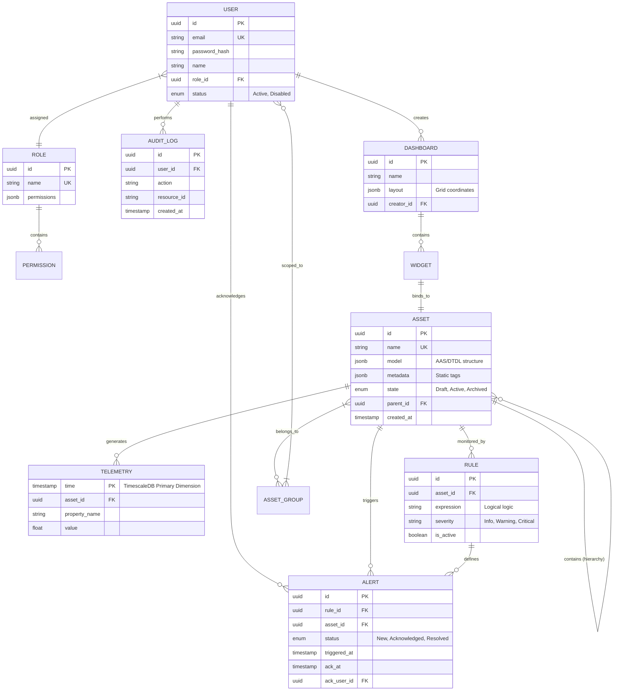

# Entity-Relationship Diagram (ERD)

This diagram visualizes the data structure of The Meridian Grid, designed to fulfill the requirements defined in the SRS.

### Architectural Notes
1.  **TimescaleDB Integration:** The `TELEMETRY` table is designed as a Hypertable, where `time` is the primary partitioning dimension for high-performance time-series ingestion.
2.  **Flexible Schemas:** `ASSET.model` and `DASHBOARD.layout` use `JSONB` to support heterogeneous hardware and dynamic HMI configurations without database migrations.
3.  **Recursive Hierarchy:** `ASSET.parent_id` allows for infinite nesting of machines, stations, and sites.
4.  **Security Scoping:** The `ASSET_GROUP` to `USER` relation enables the "Scoped Access" requirement (IAM-13).
