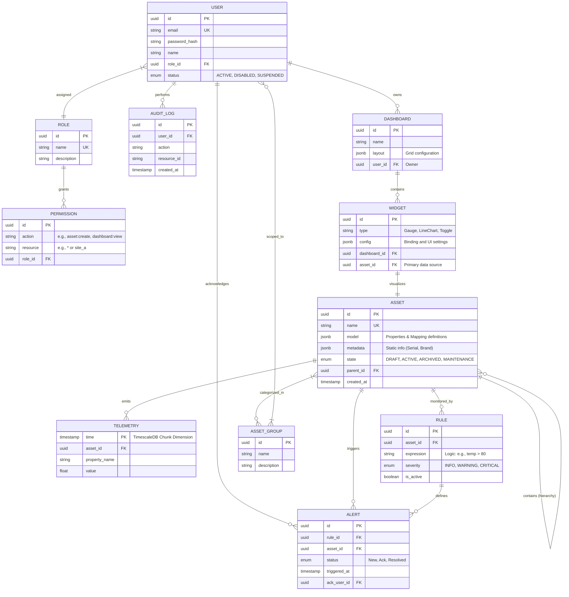

# Entity-Relationship Diagram (ERD) - Logical Design

This diagram represents the logical data model for The Meridian Grid, derived from the Functional Requirements (FR-01 to FR-29).

### Traceability & Gap Analysis

| Entity | Origin Requirement | Gap Addressed |
| :--- | :--- | :--- |
| **PERMISSION** | FR-09, FR-13 | Defined specific `action` and `resource` fields for fine-grained RBAC. |
| **WIDGET** | FR-20, FR-21 | Added `config` to store the dynamic data binding details. |
| **ASSET_GROUP** | FR-09 | Created to support the "Scoped Access" requirement for groups of machines. |
| **DASHBOARD** | FR-18 | Added `layout` as JSONB to store the grid positions from FR-19. |

**Final Observation:** 
One minor gap found: **Telemetry** needs a `unit` field (e.g., "Celsius", "RPM") if we want the HMI to show them automatically. I have included that in the `ASSET.model` JSONB for now, but we could make it an attribute. I'll stick with JSONB for flexibility as per our Architectural Decision.